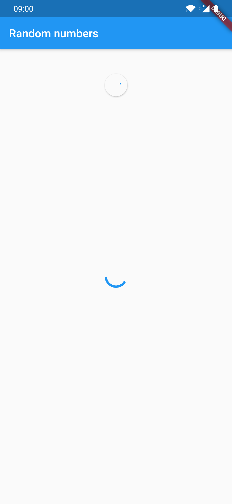
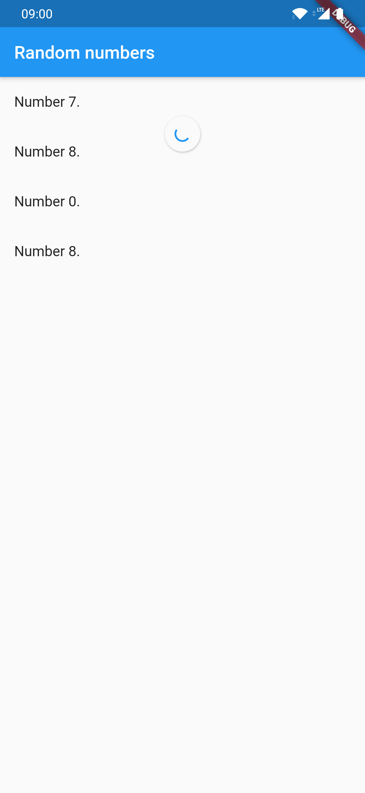
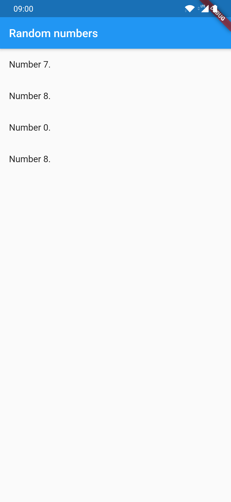
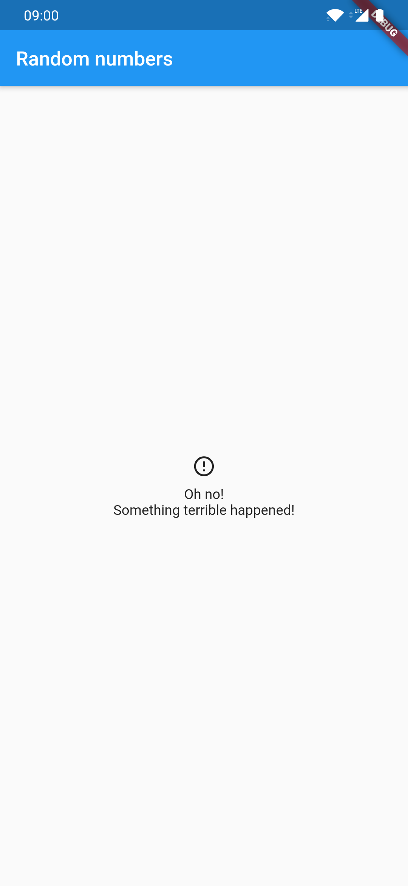
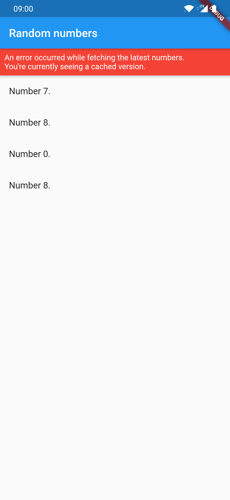
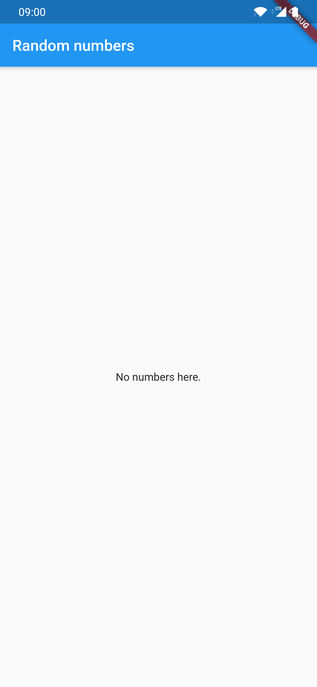

When building an app that caches data, there are many special cases to think about.

For example, according to the [Material Design guidelines](https://material.io), you need to worry about displaying [offline data](https://material.io/design/communication/offline-states.html), handling [swipe to refresh](https://material.io/design/platform-guidance/android-swipe-to-refresh.html), showing [error banners](https://material.io/design/communication/confirmation-acknowledgement.html) and displaying [empty states](https://material.io/design/communication/empty-states.html).

This package tries to make implementing cached Flutter apps as easy as possible.

| loading with no data in cache | loading with data in cache              | loading successful          |
| ----------------------------- | --------------------------------------- | --------------------------- |
|    |  |  |

| error with no data in cache          | error with data in cache         | no data available               |
| ------------------------------------ | -------------------------------- | ------------------------------- |
|  |  |  |

## Usage

First, create a `CacheController`. This will be the class that orchestrates the fetching of data.

```dart
var controller = CacheController<Item>(
  // Does the actual work and returns a Future<Item>.
  fetcher: _downloadData,
  // Asynchronously saves an Item to the cache.
  saveToCache: _saveToCache,
  // Asynchronously loads a Item from the cache.
  loadFromCache: _loadFromCache,
);
```

Then, you can use a `CachedBuilder` and provide builders for all the special cases:

```dart
CachedBuilder(
  controller: controller,
  errorBannerBuilder: (context, error, stackTrace) => ...,
  errorScreenBuilder: (context, error, stackTrace) => ...,
  builder: (context, item) => ...,
),
```

And that's it!

> **Note**: By default, the `CachedBuilder` assumes that the `builder` returns a scrollable widget, like a `ListView` or `GridView`. If that's not the case, you need to set `hasScrollBody` to `false` in order for the swipe to refresh to work.

If you want to create a `CacheController` on the fly, you can also provide a `controllerBuilder`. Then, you'll also won't have to worry about disposing it.

```dart
CachedBuilder(
  controllerBuilder: () => CacheController(
    saveToCache: ...,
    loadFromCache: ...,
    fetcher: ...,
  ),
  errorBannerBuilder: (context, error, stackTrace) => ...,
  errorScreenBuilder: (context, error, stackTrace) => ...,
  builder: (context, item) => ...,
),
```

## How does it work?

The `CacheController` offers an `updates` stream of `CacheUpdate`s which is filled with updates once `controller.fetch()` is called.

If you want to react to every update manually, you can use `CachedRawBuilder`, which takes a builder with `context` and an `update`.
