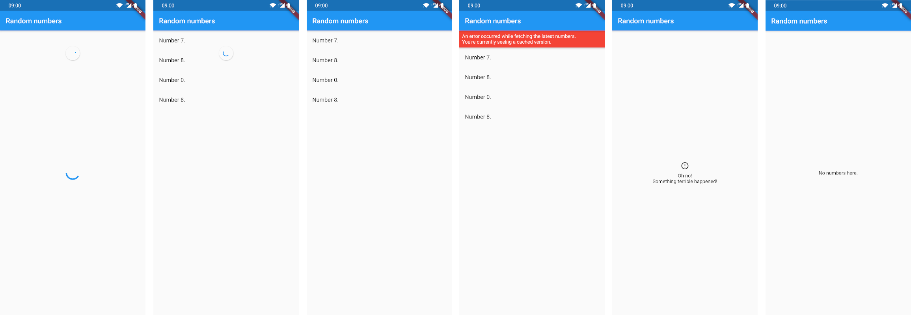

# cached_listview

When building a screen that displays a cached list of items, there are many special cases to think about.

For example, on [material.io](https://material.io), there are guidelines on [how to handle displaying offline data](https://material.io/design/communication/offline-states.html) and when to use [error banners](https://material.io/design/communication/confirmation-acknowledgement.html) or [empty states](https://material.io/design/communication/empty-states.html).

This package tries to make implementing cached ListViews as easy as possible.



## Usage

First, create a `CacheManager`. This will be the class that orchestrates the fetching of data.

```dart
var cacheManager = CacheManager<Item>(
  // Does the actual work and returns a Future<List<Item>>.
  fetcher: _downloadData,
  // Asynchronously saves a List<Item> to the cache.
  saveToCache: _saveToCache,
  // Asynchronously loads a List<Item> from the cache.
  loadFromCache: _loadFromCache,
);
```

Then you can create a `CachedListView` in your widget tree:

```dart
CachedListView(
  manager: cacheManager,
  itemBuilder: (context, item) => ...,
  errorBannerBuilder: (context, error) => ...,
  errorScreenBuilder: (context, error) => ...,
),
```
